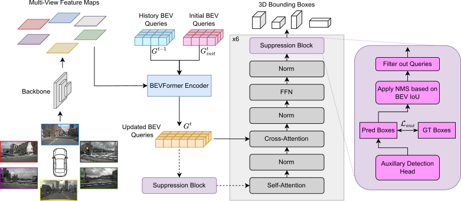

# DenseBEV: Transforming BEV Grid Cells into 3D Objects
This is the official repository for DenseBEV which will be published at WACV 2026.

 **Authors**: Marius Dähling, Sebastian Krebs and J. Marius Zöllner

 <div align="center">
  
</div><br/>


 # Abstract
 In current research, BEV-based transformers are increasingly utilized for multi-camera 3D object detection. 
Traditional models often employ random queries as anchors, optimizing them successively.
Recent advancements complement or replace these random queries with detections from auxiliary networks. 
We propose a more intuitive and efficient approach by using BEV feature cells directly as anchors.
This end-to-end approach leverages the dense grid of BEV queries, considering each cell as a potential object for the final detection task.
As a result, we introduce a novel two-stage anchor generation method specifically designed for multi-camera 3D object detection. 
To address the scaling issues of attention with a large number of queries, we apply BEV-based NMS, allowing gradients to flow only through non-suppressed objects.
This ensures efficient training without the need for post-processing.
By using BEV features from encoders such as BEVFormer directly as object queries, temporal BEV information is inherently embedded. 
Building on the temporal BEV information already embedded in our object queries, we introduce a hybrid temporal modeling approach by integrating prior detections to further enhance detection performance.
Evaluating our method on the nuScenes dataset shows consistent and significant improvements in NDS and mAP over the baseline, even with sparser BEV grids and therefore fewer initial anchors.
It is particularly effective for small objects, enhancing pedestrian detection with a $3.8\%$ mAP increase on nuScenes and an 8% increase in LET-mAP on Waymo.
Applying our method, named DenseBEV, to the challenging Waymo Open dataset yields state-of-the-art performance, achieving a LET-mAP of 60.7%, surpassing the previous best by 5.4%.


 # Getting Started

## Installation
A Dockerfile is provided that includes all required dependencies, including CUDA kernels for NMS and the Waymo metrics package.  
Build the Docker image by running:
```
docker build -f docker/Dockerfile -t densebev .
```

If you prefer to install dependencies manually, you can install the custom ops module with:
```
cd ops && pip install .
```

## Dataset preparation
### NuScenes
We use the same .pkl format as BEVFormer. Please refer to their dataset preparation guide: https://github.com/fundamentalvision/BEVFormer/blob/master/docs/prepare_dataset.md

Notes:
- We use a newer version of mmdet3d (v1.0.0rc6) to limit outdated dependencies.
- The .pkl files must be generated using the BEVFormer setup, which uses an older mmdet3d version.
- To avoid the overhead of setting up two environments, we also provide the processed .pkl files. Download the files here ([train](https://drive.google.com/file/d/1yRSZTKtF1RLfozRkbKjfwGCTdNJlMoB7/view?usp=sharing)/[val](https://drive.google.com/file/d/1Ov1OsdsOGhVXOjEw15kGigjtuPDsQ7s0/view?usp=sharing)).

Disclaimer: The pkl files contain data derived from the nuScenes dataset. They are © Motional and are licensed under the same terms as the original dataset: CC BY-NC-SA 4.0 and the nuScenes Dataset Terms (https://www.nuscenes.org/terms-of-use).
Use of these files is permitted for non-commercial purposes only and must follow the nuScenes license.


### Waymo
Waymo dataset preparation and conversion is more laborious.
Detailed instructions can be found here:
https://mmdetection3d.readthedocs.io/en/latest/advanced_guides/datasets/waymo.html.

Notes:
- The conversion may take take several hours.
- In mmdet3d version 1.4, the function create_waymo_info_file casts ego2global to float32, which can cause issues when loading the pose as a quaternion later. To fix this, remove the type-casting before running the conversion.
- If cam_gt.bin is missing, you can generate it using this [script](https://github.com/Tai-Wang/Depth-from-Motion/blob/main/tools/create_waymo_gt_bin.py).


## Train and Test
Train DenseBEV with 8 GPUs
```
./tools/dist_train.sh ./projects/configs/dense_bev/dense_bev_nusc_memory.py 8
```
Evaluate DenseBEV with 8 GPUs
```
./tools/dist_test.sh ./projects/configs/dense_bev/dense_bev_nusc_memory.py ./path/to/ckpts.pth 8
```
Note: If you use a batch size different than 8, make sure to adjust the dataset config in case you use a memory model, as those trainings are iteration based.

# Experimental results
## NuScenes
|Method|Backbone| BEV Size | NDS | mAP | Config | Weights|
| - | - | - | - | - | - | - |
|DenseBEV - tiny | ResNet-50 | 50x50 | 40.4 | 27.8 | [config](projects/configs/dense_bev/dense_bev_nusc_tiny.py) | [model](https://drive.google.com/file/d/14yjlfy2Uu39RlgMZiCuU2ius4HX8P5B2/view?usp=sharing)
|DenseBEV++ - tiny | ResNet-50 | 50x50 | 41.3 | 30.0 | [config](projects/configs/dense_bev/dense_bev_nusc_memory_tiny.py) | [model](https://drive.google.com/file/d/1wGh6IiGHDX05P8mwf8yCyXdvn7QgTOVV/view?usp=sharing)
|DenseBEV - small | ResNet-101 | 150x150 | 51.0 | 40.5 | [config](projects/configs/dense_bev/dense_bev_nusc_small.py) | [model](https://drive.google.com/file/d/1BixdMEfzuvZCsAzEQka7OgY6VBud57lh/view?usp=sharing)
|DenseBEV++ - small | ResNet-101 | 150x150 | 52.8 | 42.8 | [config](projects/configs/dense_bev/dense_bev_nusc_memory_small.py) | [model](https://drive.google.com/file/d/1xH0onIvtq17G6JYTr9Vdxlab5o90X4kb/view?usp=sharing)
|DenseBEV - base | ResNet-101 | 200x200 | 53.5 | 43.3 | [config](projects/configs/dense_bev/dense_bev_nusc.py) | [model](https://drive.google.com/file/d/106DOdvlb3_pGLOHBIBzKYJzZjU7DDwoH/view?usp=sharing)
|DenseBEV++ - base | ResNet-101 | 200x200 | 54.9 | 44.9 | [config](projects/configs/dense_bev/dense_bev_nusc_memory.py) | [model](https://drive.google.com/file/d/1Ogu7TCtF0beL0eLSFLtoHLFzyqMJDM38/view?usp=sharing)

## Waymo
|Method|Backbone| BEV Size |mAPL|mAP| mAPH | Config |
| - | - | - | - | - |  - |  - |
|DenseBEV - base | ResNet-101 | 200x200 | 41.1 | 58.3 | 54.6 | [config](projects/configs/dense_bev/dense_bev_waymo.py)
|DenseBEV++ - base | ResNet-101 | 200x200 | 43.2 | 60.7 | 56.9 | [config](projects/configs/dense_bev/dense_bev_waymo_memory.py) 

Due to the Waymo Dataset License Agreement, we cannot provide the model weights.

# License
See [LICENSE](LICENSE) for more details.

# Acknowledments
Our implementation is build upon mmdetection3d. 
Furthermore we rely on the code of [BEVFormer](https://github.com/fundamentalvision/BEVFormer), [StreamPETR](https://github.com/exiawsh/StreamPETR) as well as [OpenPCDet](https://github.com/open-mmlab/OpenPCDet).
This work wouldn't have been possible without the invaluable contributions of the aforementioned projects and numerous other high-quality open-source initiatives. 
Many thanks to them for enabling our research!
